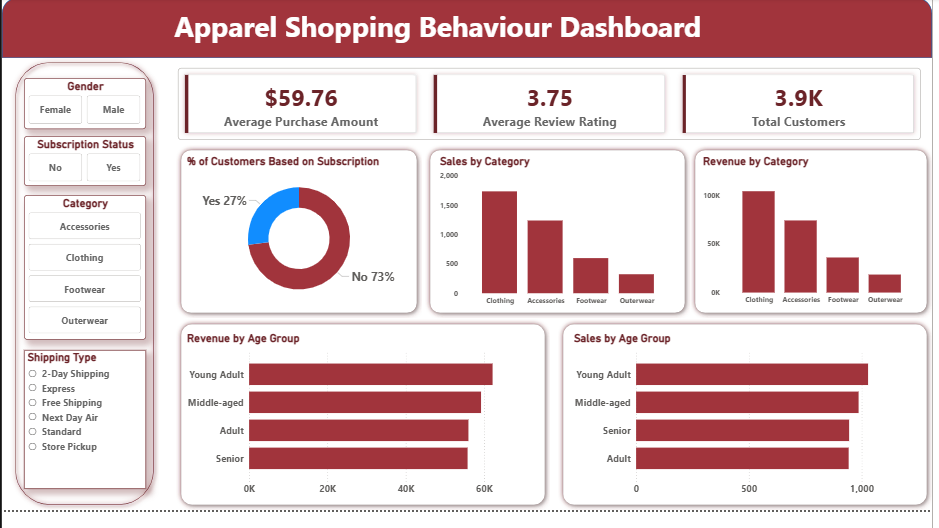

# Apparel Customer Purchasing Analysis

> An end-to-end analysis of apparel retail customer purchasing behavior using Python, MySQL, and Power BI

[](https://www.python.org/)
[](https://www.mysql.com/)
[](https://powerbi.microsoft.com/)



---

## Executive Summary

### Business Context
Understanding customer purchasing behavior is critical for apparel retailers seeking to improve retention, optimize promotions, and increase revenue. This analysis examines 3,900 customer transactions to answer key business questions:

- How does spending differ between subscribers and non-subscribers?
- Which products and categories perform best?
- What role do discounts and shipping options play?
- How can customers be segmented based on purchase history?

### Key Findings
Analysis reveals that **subscription status does not affect purchase value**:
- Subscribers: $59.49 average purchase
- Non-subscribers: $59.87 average purchase

However, **non-subscribers drive 73% of total revenue** ($170K vs $63K) due to higher customer volume, not higher spending.

### Business Impact
1. **Subscription model not increasing per-transaction spend**
2. **Revenue dependent on non-subscriber activity** (churn risk exposure)
3. **Subscription adoption only 27%** (under-utilized program)

### Strategic Recommendations
1. **Reposition subscriptions around retention, not spend**  
   Since subscriptions do not increase order size, value should focus on repeat engagement, convenience, or exclusivity.

2. **Target high-frequency non-subscribers**  
   Most repeat buyers (>5 previous purchases) are non-subscribers (2,518 vs. 958), making them prime candidates for conversion.

3. **Optimize for purchase frequency**  
   Increasing transaction frequency among subscribers is more viable than increasing average order value.


### Conclusion
Revenue in this apparel retail dataset is driven primarily by **customer volume and repeat purchasing behavior**, not by subscription status or shipping incentives. Discounts remain effective across high-value transactions, and product performance varies meaningfully by category. These findings support strategies centered on **retention, targeted subscription conversion, and category-level optimization** rather than increasing per-transaction spend.

---

## Project Overview

This project demonstrates a complete data analytics workflow for apparel retail, from data cleaning to business recommendations:

1. **Data Cleaning & Preparation (Python)**
   - Handling missing values with category-wise imputation
   - Standardizing column names and data types
   - Feature engineering for analytical use

2. **Data Storage & Analysis (MySQL)**
   - Persisting cleaned data in relational database
   - Analytical queries using aggregations, CTEs, and window functions
   - Advanced segmentation and performance metrics

3. **Data Visualization (Power BI)**
   - Interactive dashboard with dynamic filtering
   - Revenue trends and customer segment analysis
   - Product and category performance visuals

---

## Dataset Information

- **Total Records:** 3,900 customer transactions
- **Features:** 19 columns (post-feature engineering)
- **Source:** `apparel_shopping_behaviour.csv`

### Dataset Schema

| Column | Type | Description |
|--------|------|-------------|
| customer_id | int64 | Unique customer identifier |
| age | int64 | Customer age |
| gender | object | Customer gender |
| item_purchased | object | Purchased item |
| category | object | Product category |
| purchase_amount | int64 | Purchase amount (USD) |
| location | object | Customer location |
| size | object | Product size |
| color | object | Product color |
| season | object | Season of purchase |
| review_rating | float64 | Customer rating (1-5) |
| subscription_status | object | Yes/No subscription status |
| shipping_type | object | Shipping method used |
| discount_applied | object | Discount applied (Yes/No) |
| previous_purchases | int64 | Number of prior purchases |
| payment_method | object | Payment method |
| frequency_of_purchases | object | Text-based frequency |
| age_group | category | Quartile-based age group |
| purchase_frequency_days | int64 | Numeric frequency (days) |

---

## Technologies Used

### Data Processing
- **Python 3.13.5** - pandas, numpy, sqlalchemy
- **MySQL 8.0** - Relational data storage and querying
- **Power BI** - Interactive dashboards and reporting

---

## Getting Started

### Prerequisites
```bash
Python 3.13+
MySQL 8.0+
Power BI Desktop
```

### Installation

1. **Clone the repository**
```bash
git clone https://github.com/irene-vanessa/apparel-customer-purchasing-analysis.git
cd apparel-customer-purchasing-analysis
```

2. **Install Python dependencies**
```bash
pip install -r requirements.txt
```

3. **Set up MySQL database**
```sql
CREATE DATABASE apparel_shopping_analysis;
```

4. **Run data cleaning script**
```bash
python python/apparel_shopping_data_cleaning.ipynb
```

5. **Execute SQL analysis queries**
```bash
mysql -u root -p apparel_shopping_analysis < sql/apparel_shopping_analysis_eda.sql
```

6. **Open Power BI dashboard**
```
Open powerbi/apparel_shopping_dashboard.pbix in Power BI Desktop
```

---

## Data Cleaning & Feature Engineering

### Key Processing Steps

1. **Missing Value Treatment**
   - Filled missing `review_rating` values using category-level median ratings
   - Rationale: Different product categories have different rating patterns

2. **Column Standardization**
   - Converted all column names to lowercase
   - Replaced spaces with underscores
   - Renamed `purchase_amount_(usd)` to `purchase_amount`

3. **Feature Engineering**
   - **Age Groups:** Created quartile-based bins (Young Adult, Adult, Middle-aged, Senior)
   - **Purchase Frequency:** Converted text to numeric days (Weekly=7, Monthly=30, etc.)

4. **Data Quality**
   - Removed redundant `promo_code_used` column (identical to `discount_applied`)
   - Validated data integrity across all transformations

### Feature Engineering Details

**Age Group Classification:**
- Young Adult (18-33)
- Adult (34-47)
- Middle-aged (48-60)
- Senior (61+)

**Purchase Frequency Mapping:**
| Frequency | Days |
|-----------|------|
| Weekly | 7 |
| Bi-Weekly/Fortnightly | 14 |
| Monthly | 30 |
| Quarterly/Every 3 Months | 90 |
| Annually | 365 |

---

## Key Results

### Business Metrics

- **Total Revenue Analyzed:** $233,081  
- **Total Customers:** 3,900  
- **Average Purchase Value:** ~$59.76  
- **Subscriber Rate:** ~27% (1,053 subscribers)  
- **Average Customer Rating:** ~3.75 / 5.0  

---

## Customer Insights

1. **Subscription Paradox**  
   Subscribers do not spend more per transaction than non-subscribers.

2. **Revenue Volume Driver**  
   Approximately 73% of revenue is generated by non-subscribers due to higher customer volume.

3. **Age Group Revenue Distribution**  
   Revenue is relatively evenly distributed across age groups, with **Young Adults** generating the highest total revenue.

4. **Discount Behavior**  
   Discounts are frequently applied even to above-average purchase amounts, indicating effectiveness without clear revenue dilution.

5. **Category Performance**  
   Product leadership varies by category (e.g., Jewelry in Accessories, Blouse in Clothing), rather than one dominant product overall.

---

## Customer Segmentation

Based on transaction history:

- **Loyal Customers (>10 purchases):** 3,116  
- **Returning Customers (2–10 purchases):** 701  
- **New Customers (1 purchase):** 83  

The customer base is heavily skewed toward loyal customers, suggesting strong retention but limited recent acquisition.

---

## SQL Analysis Scope

1. **Revenue Analysis**
   - Gender-based revenue comparison
   - Age group revenue distribution

2. **Discount Impact**
   - High-value customers using discounts

3. **Product Performance**
   - Top-rated products
   - Best sellers by category
   - Discount adoption rates

4. **Shipping Analysis**
   - Purchase patterns by shipping type
   - Express vs Standard comparison

5. **Subscription Analysis**
   - Subscriber spending patterns
   - Repeat buyer correlation

6. **Customer Segmentation**
   - New/Returning/Loyal classification
   - Purchase behavior analysis

**[View SQL Queries →](sql/apparel_shopping_analysis_eda.sql)**

---

## Power BI Dashboard

### Dashboard Features
- Interactive filters (Gender, Subscription, Category, Shipping Type)
- Revenue analysis by multiple dimensions
- Customer segmentation visualizations
- Product and category performance metrics

### Key Visuals
- Revenue by gender and age group
- Subscription status distribution
- Sales and revenue by category
- Customer segment breakdown
- Shipping type analysis


---

## Business Recommendations

Based on the analysis, the following actions are recommended:

1. **Subscription Program Overhaul**
   - Current benefits not driving higher spending
   - Shift to engagement-driving perks (early access, exclusive items)
   - Measure success via retention and frequency, not transaction size

2. **Targeted Conversion Campaigns**
   - Focus on high-value non-subscribers (5+ purchases)
   - These customers already demonstrate loyalty
   - Conversion could stabilize revenue and reduce churn risk

3. **Frequency-Based Incentives**
   - Launch subscriber-exclusive monthly promotions
   - Implement replenishment reminders
   - Create tiered rewards for purchase frequency

4. **Revenue Diversification**
   - Reduce dependency on non-subscriber volume
   - Build sustainable subscriber base
   - Focus on customer lifetime value metrics

---

## Repository Structure

```text
apparel-customer-purchasing-analysis/
│
├── README.md                                    # Project documentation
├── requirements.txt                             # Python dependencies
├── .gitignore                                   # Git ignore rules                                     
│
├── data/
│   └── apparel_shopping_behaviour.csv           # Raw dataset (3,900 records)
│
├── python/
│   └── apparel_shopping_data_cleaning.ipynb        # Data cleaning 
│
├── sql/
│   └── apparel_shopping_analysis.sql            # SQL analysis queries
│
├── powerbi/
│   └── apparel_shopping_dashboard.pbix          # Power BI dashboard
│
└── screenshots/
    ├── dashboard_overview.png                   # Dashboard full view
    ├── cte_sql_query.png                        # SQL query results
    └── feature_engineering.png                  # Python script output
```

---

## Skills Demonstrated

### Technical Skills
- **Python:** Data cleaning, feature engineering, database integration
- **SQL:** Complex queries, CTEs, window functions, aggregations
- **Power BI:** Dashboard design, data visualization, business reporting
- **Data Analysis:** Descriptive statistics, customer segmentation, performance metrics

### Business Skills
- Strategic recommendations based on data
- Customer behavior analysis
- Revenue and retention strategy
- Executive communication

### Analytical Approach
- Problem definition and scoping
- Data quality and preparation
- Insight generation
- Actionable recommendation development

---

## Future Enhancements

Potential extensions to this project:

- [ ] Statistical hypothesis testing (t-tests, ANOVA)
- [ ] Predictive modeling (churn prediction, subscription likelihood)
- [ ] Customer lifetime value (CLV) calculation
- [ ] RFM (Recency, Frequency, Monetary) segmentation
- [ ] Cohort analysis for retention tracking
- [ ] Automated ETL pipeline


---

##  License
This project is open source and available under the MIT License.

---

##  Author

**Irene Vanessa Vifah**
- GitHub: [@irene-vanessa](https://github.com/irene-vanessa)
- LinkedIn: [Irene Vanessa Vifah](http://www.linkedin.com/in/irenevanessavifah)

---

⭐ **If you found this project helpful, please consider giving it a star!** ⭐